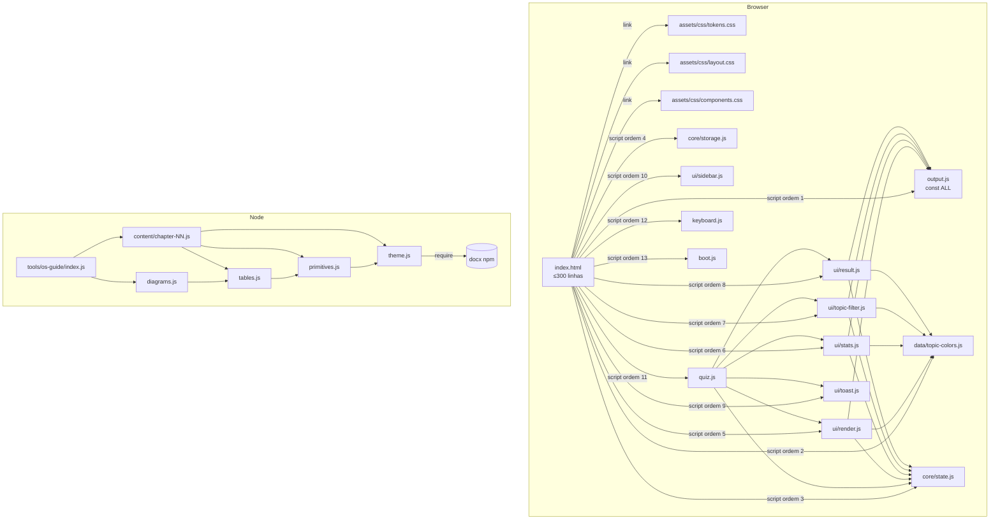

# ARCHITECTURE — Arquitectura alvo após refactor

> Documento da Fase 2. Define para onde vamos.
> Adaptado a um projecto **vanilla web app + script Node.js auxiliar** sem build system.

---

## 1. Princípios

1. **1 ficheiro = 1 responsabilidade**. Alvo ≤300 linhas, máximo absoluto 500.
2. **Sem mudar o modelo de execução**. Continuamos `<script>` clássico no browser e CommonJS no script Node — não introduzimos `type="module"` nem ESM.
3. **Sem bundler**. Os ficheiros são servidos como estão (file:// ou qualquer servidor estático). Inclusões fazem-se por `<link>` / `<script>` em ordem determinística.
4. **Sem mudar nomes públicos**. Globais que o HTML refere via `onclick="…"` (`select`, `next`, `prev`, `confirmReset`, `restartQuiz`, `toggleSection`, `toggleSidebar`) e o global `ALL` (de `output.js`) ficam intactos.
5. **Apenas mover, renomear, separar**. Sem novas abstracções, sem refactor de comportamento.
6. **Camadas com regra de dependência unidireccional** (ver §4).

---

## 2. Estrutura de pastas alvo

```
.
├── index.html                  # apenas estrutura HTML (≤300 linhas)
├── assets/
│   ├── css/
│   │   ├── tokens.css          # design tokens (:root variables, reset)
│   │   ├── layout.css          # shell / topbar / sidebar / main
│   │   └── components.css      # botões, cartões, opções, heatmap, modal, toast, mobile
│   └── js/
│       ├── data/
│       │   └── topic-colors.js # mapa TOPIC_COLORS + helpers tc(), tb()
│       ├── core/
│       │   ├── state.js        # objecto state + shuffle()
│       │   └── storage.js      # saveState() / loadState() (localStorage)
│       ├── ui/
│       │   ├── render.js       # render() principal — questão, opções, explainer
│       │   ├── stats.js        # updateStats() + heatmap
│       │   ├── topic-filter.js # buildTopicFilter() / setFilter() / mkTBtn()
│       │   ├── result.js       # showResult() / restartQuiz()
│       │   ├── toast.js        # showToast()
│       │   └── sidebar.js      # toggleSection() / toggleSidebar() (mobile drawer)
│       ├── quiz.js             # init() / select() / next/prev/skip / retryWrong / jumpTo / confirmReset
│       ├── keyboard.js         # listener global de teclado
│       └── boot.js             # boot inicial (loadState() ou init())
│
├── output.js                   # dados — const ALL = […] (mantido como está, 1 linha por pergunta)
│
├── tools/
│   └── os-guide/
│       ├── index.js            # ponto de entrada — assembleia + escrita do .docx
│       ├── theme.js            # paleta C + helpers de texto (b, t, mono)
│       ├── primitives.js       # para(), heading1/2/3, spacer, borders
│       ├── tables.js           # cell, hdrCell, tbl, row, infoBox, warningBox, successBox
│       ├── diagrams.js         # processStateDiagram, memoryLayoutDiagram, ganttChart, mlqDiagram, mlfqDiagram, deadlockRAGDiagram, diningPhilosophersDiagram, ioFlowDiagram, contextSwitchDiagram
│       └── content/
│           ├── chapter-01-intro.js
│           ├── chapter-02-startup.js
│           ├── chapter-03-processes.js
│           ├── chapter-04-scheduling.js
│           ├── chapter-05-sync.js
│           ├── chapter-06-classical-sync.js
│           ├── chapter-07-deadlocks.js
│           └── chapter-08-quick-ref.js
│
├── tests/
│   └── smoke/
│       ├── output-data.test.js     # valida estrutura de cada entrada de ALL
│       ├── html-structure.test.js  # valida que IDs DOM esperados existem
│       └── os-guide.test.js        # valida que os_guide carrega sem erro
│
├── docs/
│   ├── perguntas_quiz.md
│   ├── sistemas_operacoes_estudo__2_.md
│   └── sistemas_operacoes_estudo__2_.html
│
├── package.json                # mínimo, declara dependência de docx
├── .gitignore
├── README.md
├── CONTRIBUTING.md
├── ARCHITECTURE.md             # (este ficheiro)
├── ANALYSIS.md
└── REFACTOR_LOG.md
```

> **Conteúdo (`docs/`)** — os ficheiros `perguntas_quiz.md`, `sistemas_operacoes_estudo__2_.md` e `sistemas_operacoes_estudo__2_.html` são material de estudo. **Atenção**: `output.js` linka para `sistemas_operacoes_estudo__2_.html` em explicações (ex.: linha 1 de output.js: `target="_blank"` para `sistemas_operacoes_estudo__2_.html#…`). Mover para `docs/` exigiria reescrever 538 hrefs em `output.js`. **Decisão**: mantém-se `sistemas_operacoes_estudo__2_.html` na raiz (servido pela mesma origem que `index.html`), e só os outros dois (`.md` e `perguntas_quiz.md`) movem-se para `docs/`. Documentar esta decisão em `CONTRIBUTING.md`.

---

## 3. Camadas e responsabilidades — uma frase cada

### App web (browser)

| Camada | Pasta | Responsabilidade |
|---|---|---|
| **Dados** | `output.js` (raiz) + `assets/js/data/` | Estado externo congelado — banco de perguntas + tabelas estáticas (cores por tópico). |
| **Core** | `assets/js/core/` | Estado da sessão e persistência local — sem DOM, sem visual. |
| **UI** | `assets/js/ui/` | Renderização e DOM — lê `state` + `ALL`, escreve no DOM. |
| **Aplicação** | `assets/js/quiz.js` | Casos de uso — orquestra o que acontece quando o utilizador clica/responde. |
| **Plataforma** | `assets/js/keyboard.js`, `boot.js` | Bridge entre eventos do browser e a aplicação. |

### Script `tools/os-guide/`

| Módulo | Responsabilidade |
|---|---|
| `theme.js` | Paleta de cores + helpers de TextRun (texto, bold, mono). |
| `primitives.js` | Parágrafos, headings, espaçadores, bordas. |
| `tables.js` | Construção de tabelas e caixas de info/warning/success. |
| `diagrams.js` | Diagramas ASCII tabulares (estados de processo, memória, Gantt, …). |
| `content/chapter-NN-*.js` | Um capítulo do guia — array de blocos prontos. |
| `index.js` | Importa tudo, monta o `Document`, faz `Packer.toBuffer` + `writeFileSync`. |

---

## 4. Regra de dependência (camada → camada)

```
                  ┌──────────────────┐
                  │     boot.js      │   (entry — depende de tudo)
                  └────────┬─────────┘
                           │
                  ┌────────▼─────────┐
                  │  keyboard.js     │   (cola eventos → quiz.js)
                  └────────┬─────────┘
                           │
                  ┌────────▼─────────┐
                  │     quiz.js      │   (casos de uso)
                  └────────┬─────────┘
                           │
            ┌──────────────┼──────────────┐
            │              │              │
       ┌────▼─────┐  ┌─────▼────┐  ┌──────▼─────┐
       │   UI     │  │  CORE    │  │  DATA      │
       │  (DOM)   │◀─│ (state)  │◀─│ (ALL,      │
       │          │  │          │  │  TOPIC_…)  │
       └──────────┘  └──────────┘  └────────────┘
```

**Regras (top → bottom apenas):**
- `boot.js` pode importar tudo.
- `quiz.js` usa UI + CORE + DATA, **nunca o contrário**.
- UI pode ler CORE e DATA, **não escreve em DATA** e **não chama quiz.js**.
- CORE não depende de UI nem de DOM (testável em Node puro).
- DATA é só dados estáticos — sem dependências.

```
tools/os-guide:

   index.js
      │
      ├─▶ content/chapter-NN-*.js  ──▶ primitives, tables, diagrams, theme
      ├─▶ diagrams.js               ──▶ tables, primitives, theme
      ├─▶ tables.js                 ──▶ primitives, theme
      ├─▶ primitives.js             ──▶ theme
      └─▶ theme.js                  ──▶ docx (npm)
```

---

## 5. Convenções de nomenclatura

| Item | Convenção | Exemplo |
|---|---|---|
| Ficheiros JS | `kebab-case.js` | `topic-filter.js`, `chapter-04-scheduling.js` |
| Ficheiros CSS | `kebab-case.css` | `tokens.css`, `components.css` |
| Funções | `camelCase` | `buildTopicFilter`, `updateStats` |
| Constantes "globais" (caché de dados, mapas) | `SCREAMING_SNAKE_CASE` | `TOPIC_COLORS`, `TOPIC_ORDER`, `ALL` |
| Variáveis locais | `camelCase`, descritivo | `correctIdx`, `filteredOrder` |
| Helpers privados de módulo `os-guide` | `camelCase` curto pode ficar (estilo DSL) | `b()`, `t()`, `cell()` — domínio é construção de docx |

---

## 6. Diagrama Mermaid (visão geral)



---

## 7. Ordem de carregamento dos scripts no `index.html`

Crítico para correctness — globais devem existir quando o próximo script avalia. Preserva semântica do `index.html` actual, onde tudo era 1 IIFE em sequência.

```html
<!-- 1. dados externos primeiro (define ALL) -->
<script src="output.js"></script>

<!-- 2. constantes / mapas estáticos -->
<script src="assets/js/data/topic-colors.js"></script>

<!-- 3. core (state mutável + storage) -->
<script src="assets/js/core/state.js"></script>
<script src="assets/js/core/storage.js"></script>

<!-- 4. UI (precisa de state, ALL, TOPIC_COLORS) -->
<script src="assets/js/ui/render.js"></script>
<script src="assets/js/ui/stats.js"></script>
<script src="assets/js/ui/topic-filter.js"></script>
<script src="assets/js/ui/result.js"></script>
<script src="assets/js/ui/toast.js"></script>
<script src="assets/js/ui/sidebar.js"></script>

<!-- 5. quiz logic (casos de uso) -->
<script src="assets/js/quiz.js"></script>

<!-- 6. plataforma -->
<script src="assets/js/keyboard.js"></script>

<!-- 7. boot — tem de ser o último -->
<script src="assets/js/boot.js"></script>
```

---

## 8. O que NÃO se vai fazer

- ❌ Adoptar TypeScript / ESLint / Prettier (mudaria toolchain — fora de scope).
- ❌ Adoptar bundler ou framework.
- ❌ Refactor do conteúdo dos `.md` / `.html` de estudo — é matéria de domínio.
- ❌ Refactor do schema de `output.js` — quebraria 538 entradas e o leitor da app.
- ❌ Corrigir bugs identificados na fase 1 — apenas registar.
- ❌ Mudar versão de Node ou adicionar polyfills.

---

## 9. Critérios de pronto

Refactor termina quando:
- `index.html` tem **apenas estrutura HTML** (≤300 linhas, 0 `<style>` inline volumoso, 0 `<script>` inline volumoso).
- `tools/os-guide/index.js` tem **apenas montagem do documento**, ≤300 linhas.
- Todos os ficheiros JS estão ≤500 linhas (alvo ≤300).
- Smoke tests passam.
- `node tools/os-guide/index.js` produz `OS_Improved_Study_Guide.docx` idêntico (ou pelo menos do mesmo tamanho ±5%) ao baseline.
- Não há `console.log` deixados de debug.
- `README.md` e `CONTRIBUTING.md` actualizados.
